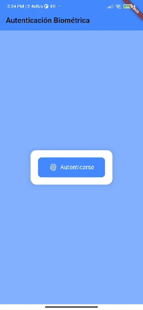
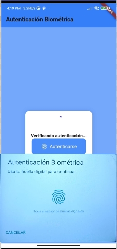
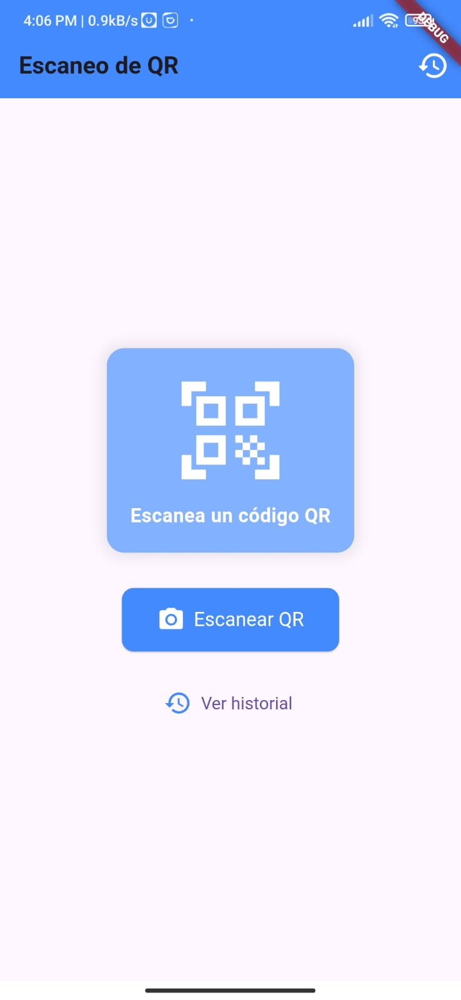
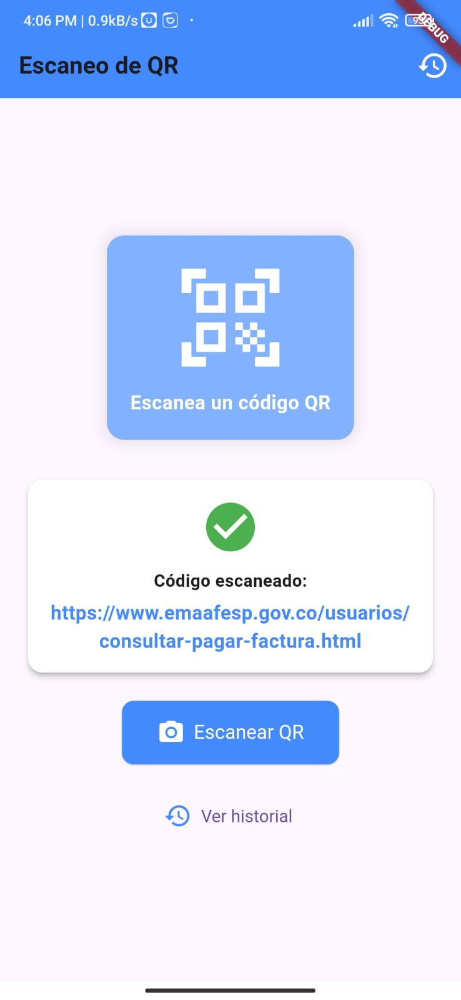
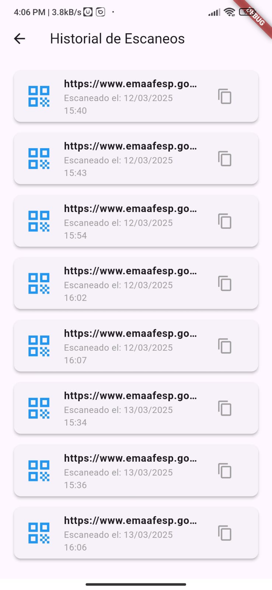
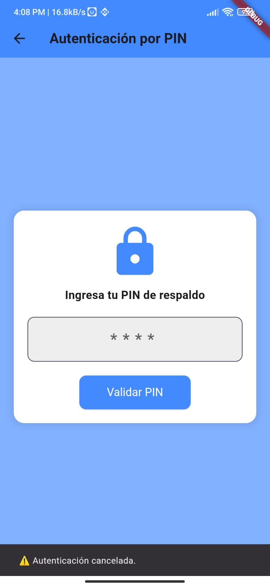

# 🏢 Flutter Clean Microfrontends

[](https://flutter.dev/)
[](https://dart.dev/)
[](https://pub.dev/packages/melos)

## 🚀 Introducción

### Y si te llegara un requerimiento como este... ¿cómo lo resolverías?

En mis proyectos anteriores, me encontré con varios desafíos: **dificultad para reutilizar código**, **múltiples repositorios para cada funcionalidad**, **complejidad en la comunicación nativa** y **manejo de estado que podía afectar el rendimiento**. Además, la gestión de dependencias en **arquitectura limpia** se volvía complicada, y las pruebas unitarias eran un reto constante.

Con años de experiencia en desarrollo, decidí crear una **base de código escalable y reutilizable**, donde encontrarás:

✅ **Manejo de monorepos con Melos**  
✅ **Creación de plugins nativos con Pigeon**  
✅ **Manejo óptimo del estado con BLoC**  
✅ **Arquitectura limpia con capas bien definidas**  
✅ **Inyección de dependencias con GetIt**  
✅ **Pruebas unitarias con Mockito**  

Este proyecto implementa una **app de autenticación biométrica, escaneo de QR y almacenamiento de historial de escaneos**, todo bajo las mejores prácticas modernas en Flutter, lo pudes correr tanto en Android e iOS sin problema.

---

## 🎯 Tecnologías y herramientas clave

- **Flutter 3.4.1** – Desarrollo de apps móviles  
- **BLoC + Equatable** – Gestión de estado  
- **GetIt + Injectable** – Inyección de dependencias  
- **Dartz** – Programación funcional  
- **Mockito + Bloc Test** – Pruebas unitarias  
- **Pigeon** – Comunicación entre Flutter y código nativo  
- **Melos** – Monorepo Management  

---

## 🏦 Arquitectura

Se implementa **Clean Architecture**, dividiendo la app en **módulos independientes**:

📺 **apps/qr_app/** – Aplicación principal  
📂 **packages/auth_biometric_plugin/** – Plugin para autenticación biométrica  
📂 **packages/qr_scanner_plugin/** – Plugin para escaneo de QR  

Cada módulo tiene sus capas:

✅ `core/` – Configuraciones globales (errores, navegación, etc.)  
✅ `data/` – Implementaciones de repositorios  
✅ `domain/` – Casos de uso y entidades  
✅ `presentation/` – UI y gestión de estado con BLoC  

---

## 🔑 **Inyección de Dependencias (GetIt + Injectable)**

Usamos `GetIt` como Service Locator e `Injectable` para la inyección automática de dependencias. Antes de ejecutar el proyecto, **asegúrate de generar las dependencias**:

```sh
flutter pub run build_runner build --delete-conflicting-outputs
```

Si hay conflictos, usa:

```sh
flutter pub run build_runner watch --delete-conflicting-outputs
```

---

## 🔗 **Comunicación Flutter-Nativo con Pigeon**

[Pigeon](https://pub.dev/packages/pigeon) permite la comunicación segura entre Flutter y código nativo **(Kotlin/Swift)** sin usar **MethodChannels**.

📈 **Ventajas de Pigeon:**  
✅ **Type-Safety** – Garantiza seguridad en los tipos de datos  
✅ **Menos Overhead** – Mejora el rendimiento respecto a `MethodChannel`  
✅ **Mejor mantenibilidad** – Código más claro y estructurado  

### 🛠️ **Generación de Código con Pigeon**

Si modificas los archivos en `pigeon/`, regenera los bindings ejecutando:

```sh
flutter pub run pigeon --input pigeons/auth_pigeon.dart
```

Esto actualizará la comunicación entre **Dart y código nativo**.

---

## 🧠 **Pruebas Automatizadas**

Se han implementado pruebas unitarias con **Mockito y Bloc Test**. Para ejecutarlas:

```sh
flutter test
```

Si quieres correr solo los tests de lógica de negocio (sin widget tests):

```sh
flutter test --exclude-tags=widget
```

---

## 🎥 **Demostración**

Aquí puedes ver un ejemplo del funcionamiento de la aplicación en acción:


#### 🎞️ GIF 



## 📸 Capturas de Pantalla 







---

## 🚀 **Configuración del Proyecto**

1️⃣ **Instalar dependencias**  
```sh
flutter pub get
melos bootstrap
```

2️⃣ **Generar código (inyección de dependencias y mocks)**  
```sh
flutter pub run build_runner build --delete-conflicting-outputs
```

3️⃣ **Ejecutar la app**  
```sh
flutter run
```

---

## 🎯 **Conclusión**

Este proyecto refleja **buenas prácticas de arquitectura en Flutter**, asegurando modularidad, escalabilidad y pruebas automatizadas. Perfecto para proyectos empresariales y entornos de alto rendimiento. 🚀

📌 **Autor:** [Christian Vargas](www.linkedin.com/in/christian-vargas-11a9a2ba)  
📌 **Repositorio:** [GitHub](https://github.com/christianvargas-dev/flutter_clean_microfrontend)  

---

✨ *Si te gustó este repositorio, ¡dale una ⭐ en GitHub y sígueme en LinkedIn!* 🚀

